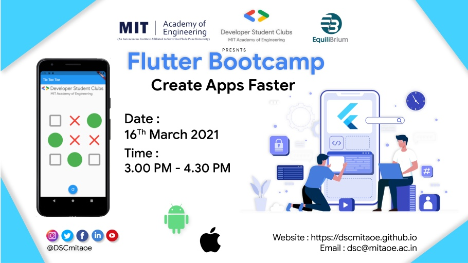
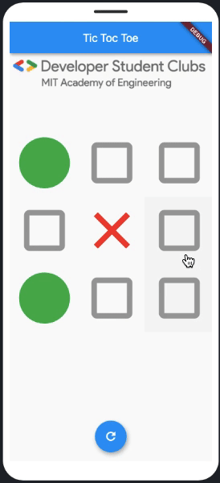
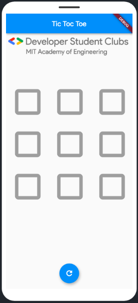
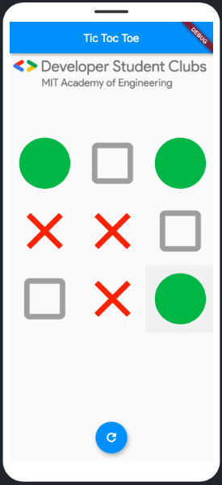

# TicTocToe Flutter

The Flutter App of TicTocToe Game.

## Tutorial
Youtube : [Watch Now](https://www.youtube.com/watch?v=zt9VXuFmQFU&t)

## Play Live 
Emulate on Dartpad : [PlayNow](https://www.youtube.com/watch?v=zt9VXuFmQFU&t)

## ScreenShot
<table style="width:100%">
  <tr>
    <th>Live</th>
    <th>Begining</th>
    <th>Playing</th>
  </tr>
  <tr>
     <td></td>
    <td></td>
    <td></td>
  </tr>
</table>

## Details
Are you ready for a showdown 🤩

Developer Student Club presents
Flutter Bootcamp: Create App Faster 🤩

The session is beginner friendly !! 
Grab the opportunity to make your APP come alive 😁
You will learn how to build Android/iOS/web/desktop application from the scratch!

🗓 16th March 2021 
🕒 3:00 PM - 4:30 PM
🎟 Free of Cost

Let's learn  new skills in app development !!!

So, see you in the event 😁
Keep Learning 😃 Keep Growing 😇

## Speaker
[Aditya Birangal](https://birangal.com)

## Organiser
[Developer Student Club MITAOE](https://dscmitaoe.github.io)

## Getting Started

This project is a starting point for a Flutter application.

A few resources to get you started if this is your first Flutter project:

- [Lab: Write your first Flutter app](https://flutter.dev/docs/get-started/codelab)
- [Cookbook: Useful Flutter samples](https://flutter.dev/docs/cookbook)

For help getting started with Flutter, view our
[online documentation](https://flutter.dev/docs), which offers tutorials,
samples, guidance on mobile development, and a full API reference.
